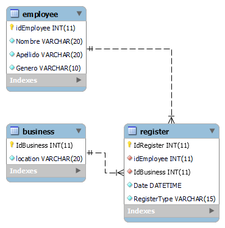

#Desafío Técnico BeClever
###Instalación
 1. **Clonar el repositorio de GitHub:**

    Abre tu terminal o línea de comandos.
    Ejecuta el siguiente comando para clonar el repositorio: <br><br>

    ```
    git clone https://github.com/FernandoNovara/Desafio.git
    ```

2. **Configurar la base de datos:**
    
    Importa el script de base de datos MySQL proporcionado en el repositorio para crear la estructura de tablas necesarias.<br>
    

    <br>

3. **Configurar el entorno:**

    Abre el proyecto en tu IDE o editor de código preferido.
    Busca el archivo de configuración de la aplicación, llamado “appsettings.json” y asegúrate de que la cadena de conexión a la base de datos sea correcta. Ajusta los parámetros según sea necesario (nombre del servidor, credenciales, etc.).<br><br>

4. **Compilar el proyecto:**

    Abre una terminal o línea de comandos en la ubicación del proyecto.
    Ejecuta el siguiente comando para compilar el proyecto<br><br>

    ```
    dotnet build
    ```

    Esto compilará el proyecto y verificará si hay errores de   compilación.<br><br>

5. **Ejecutar los servicios:**

    En la misma terminal o línea de comandos, ejecuta el siguiente  comando para iniciar la aplicación:<br><br>

    ```
    dotnet run
    ```

    La aplicación se ejecutará y comenzará a escuchar en el puerto especificado en la configuración.<br><br>

6. **Probar los servicios:**

    Utiliza una herramienta para enviar solicitudes HTTP, como Postman o cURL, para probar los servicios API.
    Envía solicitudes a las rutas correspondientes para probar los servicios definidos. Por ejemplo:<br><br>

    **Para el Service 1:**
    ```
    POST /api/registers
    {
      "idEmployee": "123",
      "date": "2023-05-10",
      "registerType": "ingreso",
      "IdBusiness": "Argentina"
    }
    ``` 
    <br>

    **Para el Service 2:**
    ```
    GET /api/registers?dateFrom=2023-05-01&dateTo=2023-05-10&descriptionFilter=apellido&businessLocation=Argentina`
    ```

    <br>

    **Para el Service 3:**<br><br>
    ```
    GET /api/average?dateFrom=2023-01-01&dateTo=2023-05-10
    ```
---
|[@Fernando Novara](https://github.com/FernandoNovara)|
 | - | 
 ---